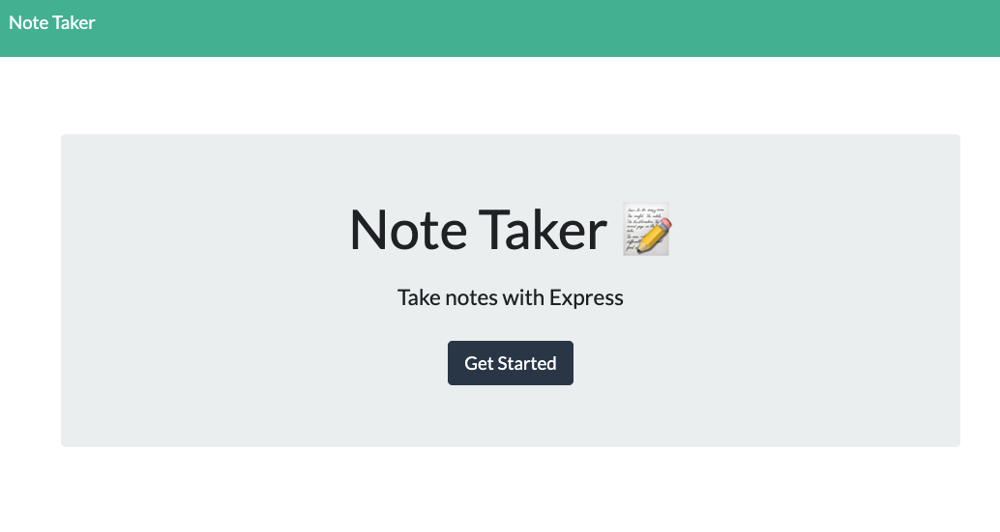

# Note Taker 

## Description
This project allows a user to take notes, save them, edit hem, and delete them as well. This project was created with backend technology like express.js and fs module.

## Built With
* Javascript
* Node
* Express.js
* Fs
* UUID

## Table of Contents
* [Installation](#installation)
* [Usage](#usage)
* [License](#License)
* [Demo](#demo)
* [Contributors](#contributors)
* [Questions](#questions)

## Installation
Node, UUID, 

## Usage 
Run "node server" in the command line. Or visit deployed Heroku link.

## Demo
[View Webpage](https://infinite-ocean-11195.herokuapp.com/)

## Questions
For any questions please reach out at:
* Github: [github.com/Xcamaj](https://github.com/Xcamaj)
* E-mail: Xhemajlcamaj@gmail.com

## Contributors
Made By Xhemajl Camaj

